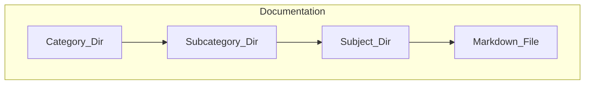

# Documentation

## Goal

This repository is a cluster of personnal documentations.
The main goal is preventing having to read the full documentation of each tool and gain time by having a neat, summed-up and simple documentation for all kind of softwares and tools.

## Structure

Here is the folder structure you should follow:

## Syntax

This documentation is written in markdown, with mermaid diagrams integrated into it. As such it should follow most recommendations for the markdown language.
