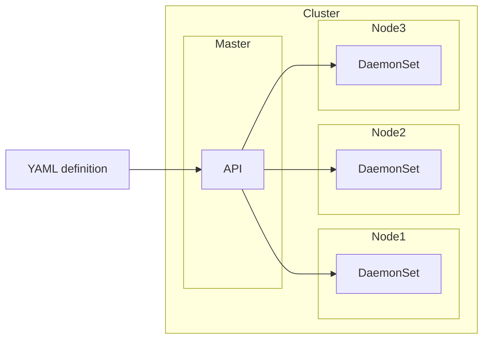

# K8s Daemon sets

A daemon set is a deployment that will create a copy of the application on every node.

## Overview



## Definition

Example:

```yaml
apiVersion: apps/v1
kind: DaemonSet
metadata:
  name: app1
spec:
  selector:
    matchLabels:
      app: app1
  template:
    metadata:
      labels:
       app: app1
    spec:
      containers:
      - name: app1
        image: image1
```
