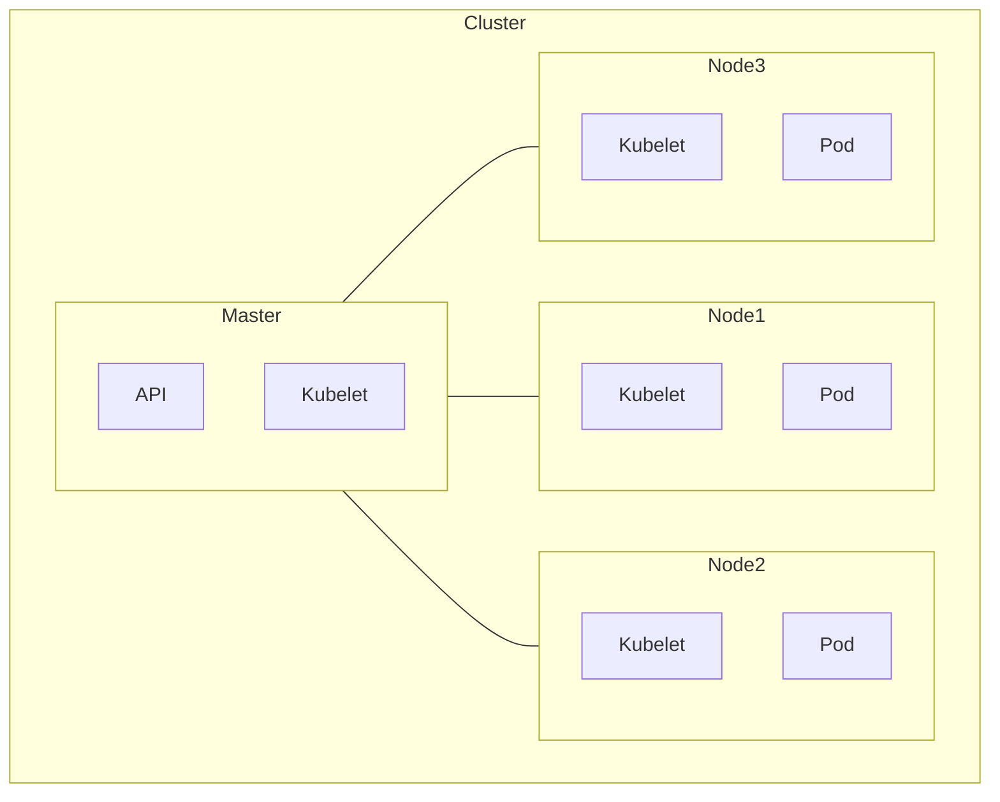

# K8s Commands

## Table of contents

- [K8s Commands](#k8s-commands)
  - [Table of contents](#table-of-contents)
  - [📊Overview Graph🗺️](#overview-graph️)
  - [🧩Kubernetes Objects🧩](#kubernetes-objects)
  - [🎓Basic commands🎓](#basic-commands)
    - [Configure kubectl](#configure-kubectl)
    - [Join a namespace](#join-a-namespace)
    - [List Objects](#list-objects)
    - [Describe Objects](#describe-objects)
    - [Get YAML definition of an object](#get-yaml-definition-of-an-object)
    - [Scale a statefulset/deployment](#scale-a-statefulsetdeployment)
    - [Create an Object form YAML definition](#create-an-object-form-yaml-definition)
    - [Update/Create an Object form YAML definition](#updatecreate-an-object-form-yaml-definition)
  - [📦Pod commands📦](#pod-commands)
    - [Execute command on a pod (Similar to docker exec exec)](#execute-command-on-a-pod-similar-to-docker-exec-exec)
    - [Copy file inside pod](#copy-file-inside-pod)
    - [Get logsform a pod](#get-logsform-a-pod)
  - [🎛️Node commands🎛️](#️node-commands️)
    - [Disable scheduling on a node](#disable-scheduling-on-a-node)
    - [Enable scheduling on a node](#enable-scheduling-on-a-node)
    - [See Nodes hardware usage (CPU,MEMORY)](#see-nodes-hardware-usage-cpumemory)
  - [👨‍✈️Kubelet👨‍✈️](#️kubelet️)
    - [Get Kubelet logs of a node](#get-kubelet-logs-of-a-node)
    - [Restart kubelet](#restart-kubelet)
  - [📑Certificates📑](#certificates)
    - [Check certificates expirations](#check-certificates-expirations)
    - [Renew certificates](#renew-certificates)

You can also manage your Kubernetes apps with [Helm](Helm/Helm_Commands.md)

## 📊Overview Graph🗺️



## 🧩Kubernetes Objects🧩

- namespaces
- [deployments](./K8s_deployment.md) (deploy)
- statefulset
- [services](./K8s_services.md) (svc)
- ingress
- persistent volume claim (pvc)
- pods (pod)
- nodes
- jobs (job)
- [daemonset](./K8s_DaemonSets.md)
- [taints](./K8s_taints_tolerations_nodeSelector_affinity.md)

## 🎓Basic commands🎓

Most of theses commands can use [labels and selectors](./K8s_labels_selectors.md)

### Configure kubectl

```bash
mkdir -p $HOME/.kube
sudo cp -i /etc/kubernetes/admin.conf $HOME/.kube/config
sudo chown $(id -u):$(id -g) $HOME/.kube/config
```

### Join a namespace

``` bash
kubectl config set-context --current --namespace=<namespace>
```

### List Objects

``` bash
kubectl get <object>
```

Options :

- More info : `-o wide`
- Get YAML format : `-o yaml`
- Get JSON format : `-o json`
- All namespaces : `-A`
- Specific namespace : `-n=<name>`

### Describe Objects

``` bash
kubectl describe <object>
```

### Get YAML definition of an object

``` bash
kubectl get <object> -o yaml
```

You can also get the definition in a cleaner manner, edit the configuration :

```bash
kubectl edit <object>
```

Then save the changes, in another file.

### Scale a statefulset/deployment

``` bash
kubectl scale <object> --replicas=<number-of-replicas>
```

### Create an Object form YAML definition

``` bash
kubectl create -f <path-to-file>
```

Options :

- Dry run : `--dry-run=client`

### Update/Create an Object form YAML definition

``` bash
kubectl apply -f <path-to-file>
```

Options :

- Dry run : `--dry-run=client`

---

## 📦Pod commands📦

### Execute command on a pod (Similar to [docker exec](../Docker/Docker_Commands.md#execute-command-in-container) exec)

``` bash
kubectl exec <pod> -- <command>
```

Options :

- Interactive mode : `-it`
- Specify specific container : `-c <container>`

Example :

- `kubectl exec -it <pod> -- bash`

### Copy file inside pod

``` bash
kubectl cp <file-to-copy> <pod>:<where-to-copy>
```

### Get logsform a pod

```bash
kubectl logs <pod-name>
```

Options :

- Get logs from all containers in pod : `--all-containers`
- Get logs from a delete pod : `--previous <pod-name>`

## 🎛️Node commands🎛️

### Disable scheduling on a node

``` bash
kubectl cordon <node-name>
```

### Enable scheduling on a node

``` bash
kubectl uncordon <node-name>
```

### See Nodes hardware usage (CPU,MEMORY)

``` bash
kubectl top nodes
```

## 👨‍✈️Kubelet👨‍✈️

### Get Kubelet logs of a node

On a kubernetes node :

```bash
journalctl -u kubelet
```

### Restart kubelet

```bash
systemctl restart kubelet
```

## 📑Certificates📑

### Check certificates expirations

```bash
sudo kubeadm certs check-expiration
```

### Renew certificates

[Follow theses instructions](./K8s_Renew_Certificates.md)
